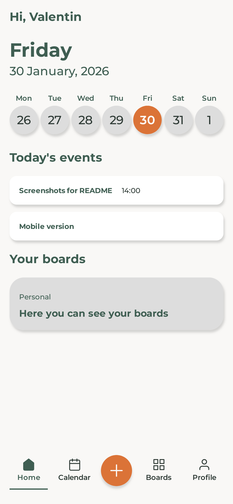
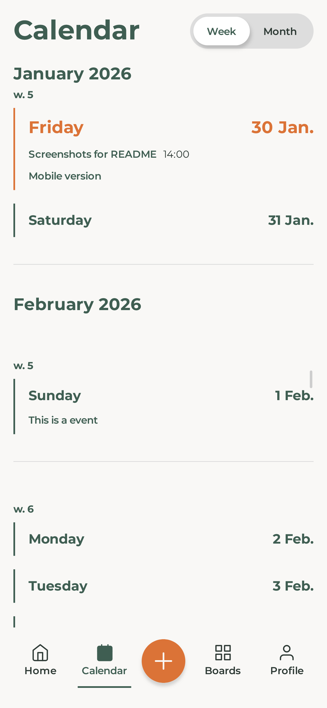
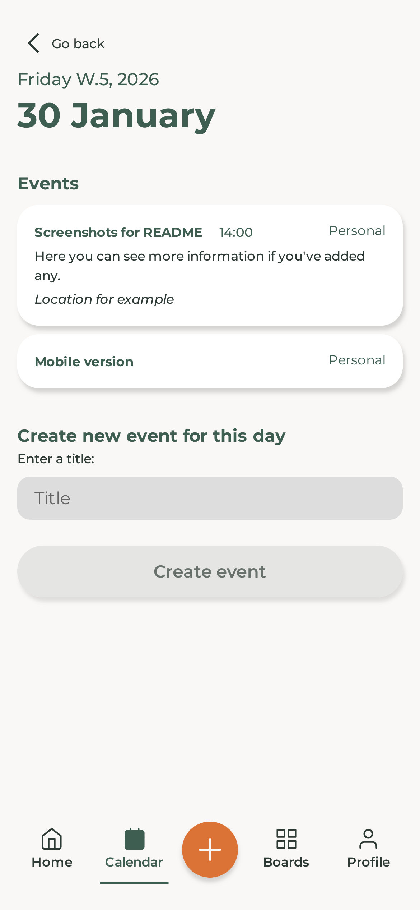
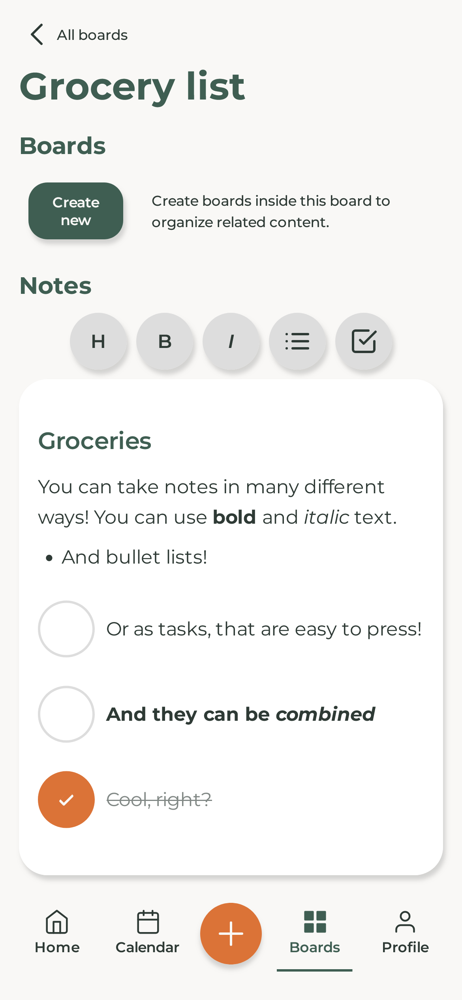
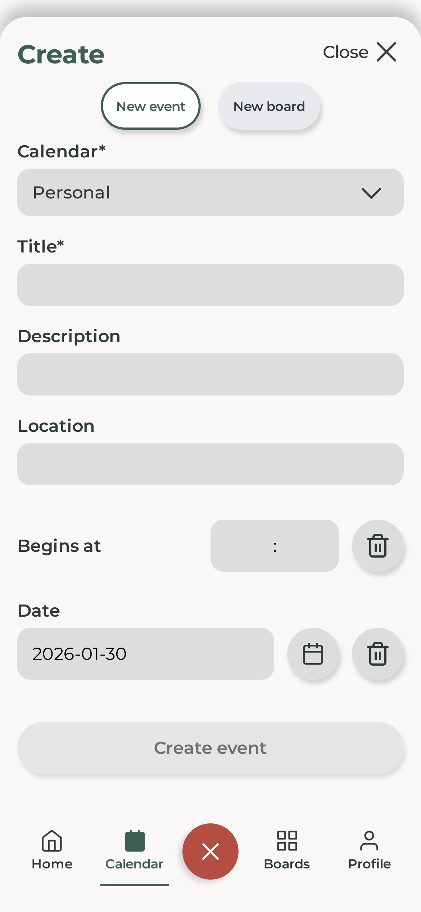
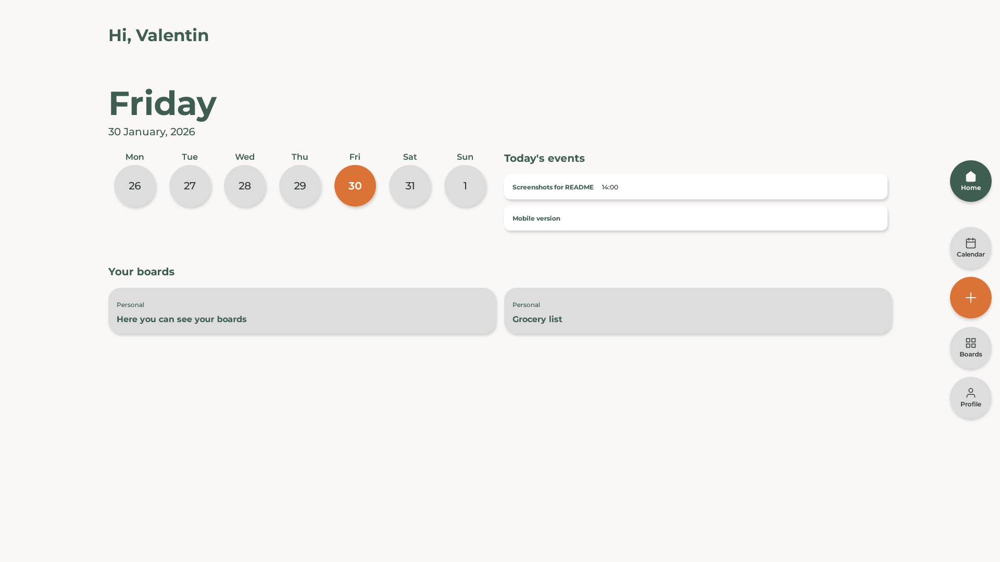
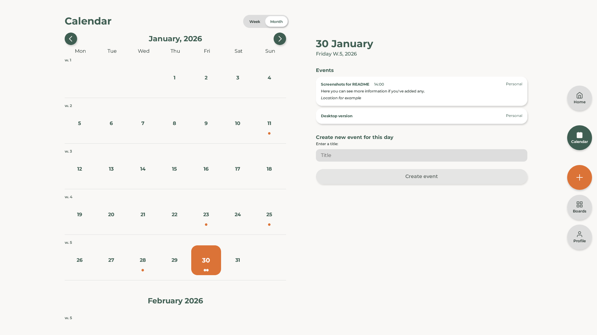
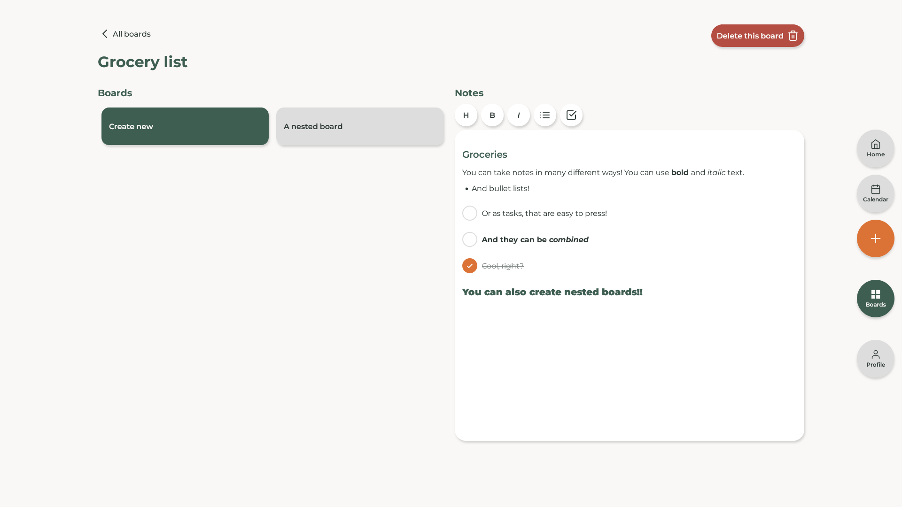

# Levo

Levo is a minimalist calendar- and notebook-application that removes the clutter and lets you focus on your life, so you can do the things you want to do. This project was developed as my final exam project that's part of my studies at @medieinstitutet to become a Frontend developer. The project aims to showcase my knowledge and skill that I've collected during my time studying, including:

- Responsive styling with SCSS (SASS)
- Accessibility (a11y) using semantic HTML
- UX design
- User testing
- JavaScript frameworks using TypeScript
- Data transferring and handling using Backend API
- Agile methodology

## 🍃 Project Overview

Levo is a minimalist calendar- and notebook-application. The web application is designed to give the user a quick, minimalistic overview of your schedule and to easily provide a way to note the things you want to do in your life. Levo wants to remove the clutter and let you focus on your life, so you can do the things you want to do. Levo is developed with a mobile-first mindset expecting usage on mobile devices, but also delivers a design for larger devices.

## 🎥 Live website

[Click here to view the live website](https://levo-eight.vercel.app/)

**If you just want to look around without signing up, feel free to use these credentials to login:**

email: demo@levo.dev

password: Levo-demo321

## 📸 Screenshots

### 📱 Mobile

<div align="center">

<table>
  <tr>
    <td><b>Sign in</b></td>
    <td><b>Landing</b></td>
    <td><b>Weekly</b></td>
  </tr>
  <tr>
    <td>
      
    </td>
    <td>
      
    </td>
    <td>
      
    </td>
  </tr>

  <tr>
    <td><b>Monthly</b></td>
    <td><b>Day</b></td>
    <td><b>Boards</b></td>
  </tr>
  <tr>
    <td>
      
    </td>
    <td>
      
    </td>
    <td>
      
    </td>
  </tr>

  <tr>
    <td><b>Board</b></td>
    <td><b>Quick create</b></td>
    <td></td>
  </tr>
  <tr>
    <td>
      
    </td>
    <td>
      
    </td>
    <td></td>
  </tr>

</table>

</div>

<!-- ### Mobile version

**Sign in - Mobile**


**Landing page - Mobile**


**Calendar weekly - Mobile**


**Calendar monthly - Mobile**


**Calendar day - Mobile**


**Boards page - Mobile**


**Board page - Mobile**


**Quick create - Mobile**
 -->

### 🖥️ Desktop

<div align="center">
<table>
  <tr>
    <td><b>Landing</b></td>
    <td><b>Weekly</b></td>
    <td><b>Monthly</b></td>
  </tr>
  <tr>
    <td>
      
    </td>
    <td>
      
    </td>
    <td>
      
    </td>
  </tr>

  <tr>
    <td><b>Board</b></td>
    <td><b>Quick create</b></td>
    <td></td>
  </tr>
  <tr>
    <td>
      
    </td>
    <td>
      
    </td>
    <td></td>
  </tr>

</table>
</div>

<!-- **Landing page - Desktop**


**Calendar weekly - Desktop**


**Calendar monthly - Desktop**


**Board page - Desktop**


**Quick create - Desktop**
 -->

## 🛠️ Functionality

Levo is built with shared functionality in mind, aiming to allow users to collaborate and share the content they create within the application. For example having shared calendars to let all members see what events are being planned, and the same thing for boards. At the moment this technically possibly from a backend perspective, however the frontend UI does not allow for users to invite each other to shared calendars yet. These shared calendars will in the future let users share calendar events and boards with their members.

The application is divided into 4 main sections:

1. **Landing page:**

- Welcomes the user with a personal greeting.
- Let the user quickly know what day and date it is, showing the current week and indicating which the current day is.
- Shows the events that are planned for today, if any exists.
- Gives the user quick access to their user-boards, if they have created any.

2. **Calendar page:**

- Let the user see a digitally rendered calendar.
- The user can choose between seeing a weekly view of the calendar or a more classic monthly view.
- In the weekly view every day is displayed, with or without planned events. Showing a small amount of detail of the existing events.
- In the monthly view every day is displayed in a more classic and well known layout, similar to a physical calendar on the wall. Each event here is only displayed as a colored dot, letting the user know something is planned on a specific day but the user must click on the day to see what exactly.
- The user can click on any day in both calendars to navigate to that specific day. Here the events for that day is displayed with the most amount of detail, such as the title, a description, location, scheduled start for the event and which calendar the event belongs to and if that calendar is a shared or personal one.
- Inside the view of specific days the user can also quickly add events for that day inside a form.

3. **Boards page:**

- This page firstly lists all the "parent-boards" the user have created. (Parent-board means that a board has no parent itself, making it the top in a hierarchy).
- By clicking a board the user will navigate to it. Inside a board the user have the possibility to create nested board, or child-boards of the parent-board. This allows the user to be creative in the way they want to use boards and organize them.
- Inside every type of board the user also has a note section where the user can type whatever they want, for example they can create grocery lists, recipe-collections or note what movies they want to see. The sky is the limit!
- The text inside the note-section can be formatted with Headings, bold text, italic text, bullet-lists, task-items and also insert links.

4. **Profile page:**

- This is at the moment a very simple page with not much functionality yet.
- Right now the user can manage their calendars, sign out and delete their account.

## 🌱 Learning Journey

Building Levo has been very educational and has given my a lot of new knowledge. The project challenged me to combine technical implementation with UX thinking, accessibility, and long-term maintainability.

Some of the key learnings from this project include:

- **Designing with accessibility in mind**  
  I worked actively with semantic HTML, focus states, keyboard navigation, and readable contrast levels to ensure the application is usable for as many users as possible.

- **Building responsive, mobile-first layouts**  
  Levo was designed with mobile usage as the primary context. This required careful planning of information hierarchy, spacing, and interaction patterns before scaling the UI up to larger screens. This also required extensive time debugging layout issues that only appeared on mobile devices, especially Safari on iOS. These challenges were largely caused by my ambition to make Levo feel more like a native app rather than a traditional website, which introduced additional complexity.

- **Managing complex UI state**  
  Handling different calendar states (day, week, month, dates, scroll), nested boards, and shared data helped me better understand state management, component responsibility, and data flow in an Angular application.

- **Working with real backend services**  
  Integrating Supabase taught me how to handle authentication, database-driven content, and asynchronous data flows, as well as how frontend decisions are tightly connected to backend structure. The choice of using Supabase was motivated by fast setup, missing out on the experience of building my own backend with a server middleware as API. This might be an option for the future of Levo.

- **Iterating based on user testing and feedback**  
  Through user testing, I learned how small UX decisions can have a large impact on usability. Several features and layouts were refined based on real user behavior rather than assumptions.

- **Thinking beyond the current scope**  
  Features such as shared calendars and boards were planned from a backend perspective even if the frontend UI is not fully implemented yet. This helped me think more long-term when structuring data and functionality, giving me an opportunity to continue working on Levo and bring it to its potential.

This project represents my ability to take an idea from concept to a fully deployed product, while continuously iterating based on real constraints and user feedback.

## 🧑‍💻 Tech Stack


### Tools:


## Project Setup

**Requirements**

- Node.js v20.19+
- npm

**To start a local development server, run:**

```bash
ng serve
```

or

```bash
npm start
```

Once the server is running, open your browser and navigate to `http://localhost:4200/`. The application will automatically reload whenever you modify any of the source files.

## ✍️ Author

Created by:

- [Valentin Björkli Castillo](https://github.com/Valentin-dot-com)

## 🤝 Credits

This project was developed as part of the curriculum at [Medieinstitutet](https://medieinstitutet.se/) during my second year of studies as a final exam project.
